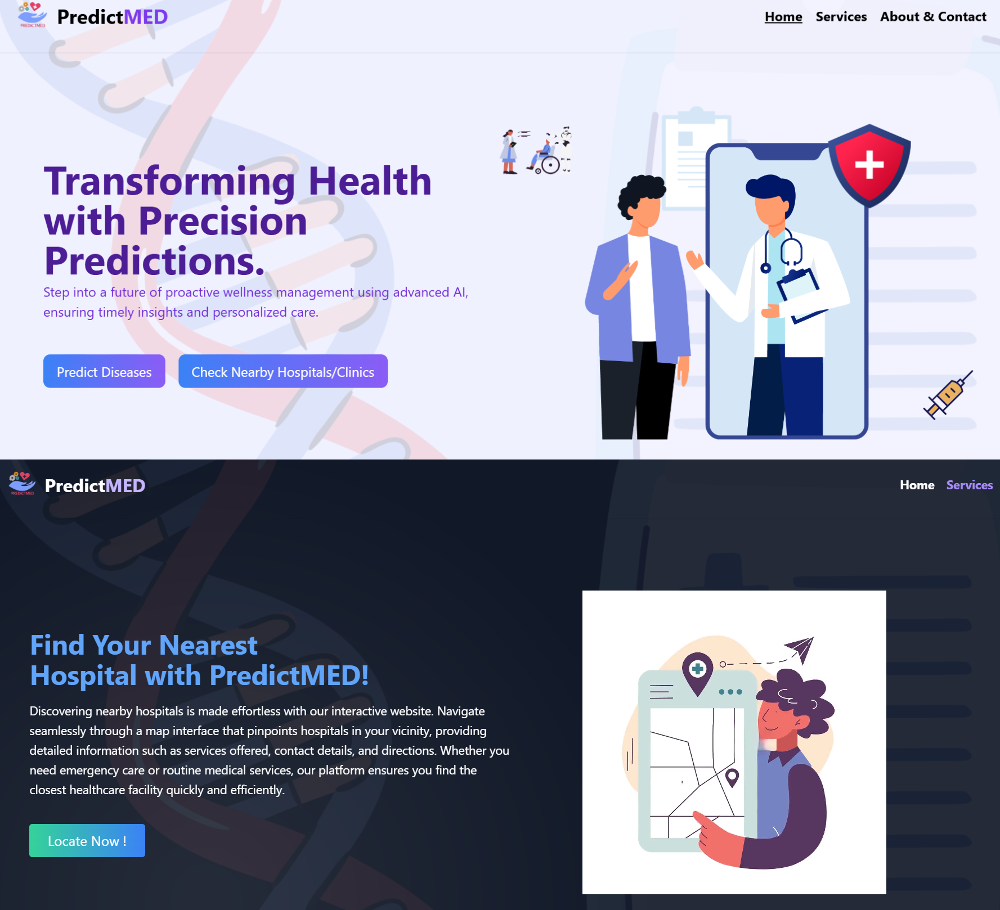

<h1>PredictMED - "Transforming Health with Precision Predictions"</h1>

The idea is to develop a website that offers predictive health analytics for conditions like diabetes, heart disease, and brain cancer, while also providing nearby hospital and clinic information for emergency situations. The website aims to deliver accurate predictions using advanced algorithms, prioritize user security through robust authentication measures, and enhance user engagement with interactive features. #healthprediction, #emergencyassistance, #predictivehealth, #healthcaretechnology, #medicalanalytics, #healthsecurity, #personalizedhealthcare, #emergencyresponse, #healthtech, #patientcare

<h4> <a href=https://nayakunal30.github.io/PredictMED/>View Demo</a>  ·  <a href="https://github.com/NayaKunal30/PredictMED/blob/master/README.md"> Documentation </a>  ·  <a href="https://github.com/NayaKunal30/PredictMED/issues"> Report Bug </a>  ·  <a href="https://github.com/NayaKunal30/PredictMED/issues"> Request Feature </a> </h4>

# :notebook_with_decorative_cover: Table of Contents

- [About the Project](#star2-about-the-project)
- [License](#warning-license)
- [Contact](#handshake-contact)

## :star2: About the Project

## :warning: License

Distributed under the no License. See LICENSE.txt for more information.

## :handshake: Contact

Kunal - - kunalnayak3004@gmail.com

Project Link: [https://github.com/NayaKunal30/PredictMED](https://github.com/NayaKunal30/PredictMED)
